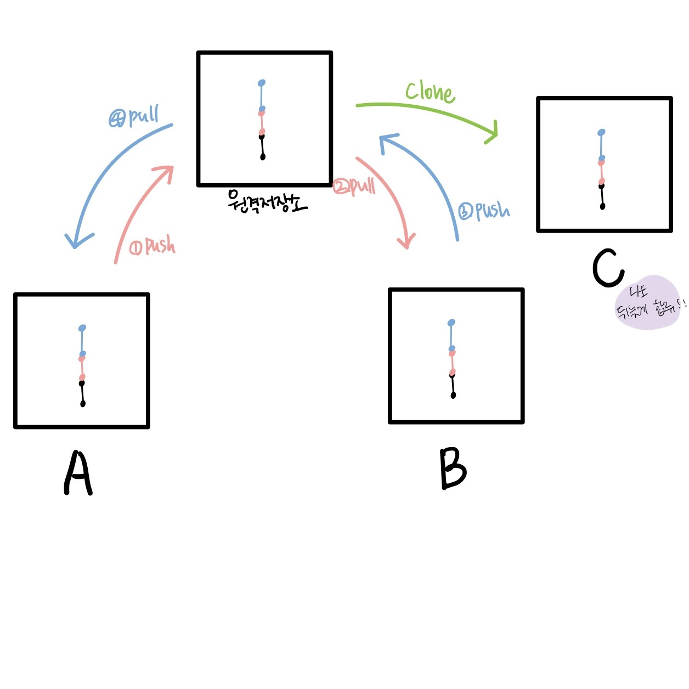

# git : 분산버전관리 시스템
  - 로컬에서 버전을 기록하고 관리
  - add, commit 하면서 버전을 기록한다
  <br>
  <br>

  ## git init
  * 특정 폴더에 git 저장소(repository)를 만들고 버전 관리
    * .git 폴더가 생성됨
    * git bash에서는 (master)라는 표기를 확인할 수 있음 (마스터가 있으면 안됨)
    * git init 명령어를 사용해야 git으로 관리 됨
  
  <br>

  ## git 버전 관리 기초 흐름
  * 작업(수정)한 파일 상태 -add-> 커밋할 파일 상태 목록 -commit-> 버전
    1. 작업을 하고
    2. 변경된 파일을 모아 (add)
    3. 버전으로 남긴다. (commit)
      1. Working Directory (1통) : 작업(수정)한 파일 상태 (와 보고서 다 썼다~) - $ git add -
      2. Staging Area(INDEX) (2통) : 버전으로 기록하기 위한 파일의 변경사항의 목록 (커밋할 파일 상태 목록) - $ git commit -
      3. Repository : 커밋(버전)들이 기록되는 곳 (3통)

  ### - 기본 명령어 -
  - add(커밋 대상 기록)
    ```
    $ git add <file>
    ```
    - working directory(1통)상의 변경 내용을 staging area(2통)에 추가하기 위해 사용
    - untracked 상태의 파일을 staged로 변경 (나중에)
    - modified 상태의 파일을 staged로 변경 (배움)
    <br>
    <br>
  - 커밋(버전 기록)
    ``` 
    $ git commit -m '<커밋메세지>'
    ```
    - Staged(2통에 있던것들) 상태의 파일들을 커밋을 통해 버전으로 기록
    - -m : 메세지 옵션
    - 커밋 메세지는 변경 사항을 나타낼 수 있도록 명확하게 작성해야 함
    <br>
    <br>
  - 파일 만들기
    ```
    $ touch 파일명
    ```
  - 유저 이메일, 이름 확인하기
    ``` 
    $ git config user.email / $ git config user.name 
    ```
  - 깃허브에 올리기
    1. $ git add 파일명
    2. $ git commit -m "이름"
    3. $ git push origin main
  
  <br>
  <br>
  
  ### - Git의 버전 관리 -
  - Git은 데이터를 파일 시스템의 스냅샷으로 관리하고 매우 크기가 작음
  - `파일이 달라지지 않으면` 성능을 위해 파일을 `새로 저장 안함`
  
  <br>
  
  ### - 현재 상태를 알고 싶어요 -
  ```
  $ git status
  ```
  - Working Directory(1통) / Staging Area(2통)의 상태를 앎
    - git 저장소에 있는 파일의 상태를 확인하기 위하여 활용
      - 파일의 상태를 알 수 있음
        * `Untracked files` (1통)
          - 1.txt 를 만들었지만, add를 하지 않음
          - (상황) 1.txt 를 만들었지만, add를 하지 않음
          
        * `Changes not staged for commit` (1통)
          - 커밋을  위해 staged가 아닌 변경 사항들
          - (상황) 커밋된 적 있는 보고서.txt 파일을 수정한 상태!
          
        * `Changes to be committed` (2통) 
          - 커밋될 변경사항들 (곧 커밋 될 애들)
          - (상황) 보고서.txt 만들고 add함.
          
        * `nothing to commit, working tree clean` 
          - (상황) 작업한 것도 커밋할 것도 없어 (1통, 2통 비어있음)

        * `nothing to commit but untracked files present (use "git add" to track)`
          - (상황) 아직 커밋할 것 없음(2통x), 트래킹 되지 않은 파일 있음(1통o)
  
  <br>

  ```
  $ git log
  ```
  - Repository(3통) 의 상태를 앎
    - 현재 저장소에 기록된 커밋을 조회
    - 다양한 옵션을 통해 로그를 조회할 수 있음
      - $ git log -1 : 최근 한개 조회
      - $ git log --oneline : 최근 한줄로 조회
      - $ git log -2 --oneline : 최근 2개를 한줄로 조회
      - ※ 하이픈의 갯수나 띄어쓰기 유의
    - commit d42a51ad5c0b5307eb885a5481ef3c19545baf74 (HEAD -> master)
      Author: mungjimangji <mungjmangji@hphk.com>
      Date:   Wed Dec 28 09:49:38 2022 +0900
    - $ git log --oneline
      d42a51a (HEAD -> master) 목표 적음 
        - d42a51a 커밋해쉬값: 고유한 커밋인지 분류해주는 도구
        - HEAD -> master : 내가 어느 위치에 있는지 알려줌

  <br>

  ```
   $ git push       # No configured push destination. (나오면 문제 없음!)
  ````
  <br>
  <br>
  <br>

# 깃허브 기반 원격저장소 활용

  <br>

  ## 명령어 
  * `push`
    - 로컬 저장소의 버전을 원격저장소로 보낸다
    - ex) git remote add origin https://github.com/mungjimangji/test1.git
    - ↑ 깃아 원격저장소 추가해줘 오리진 url으로~~
    
  * `git remote -v`
    - 기록이 잘 되는지 확인
    
  * `git push origin master`
    - 깃헙 로그인! 할게!

  * `pull`
    - 원격저장소의 버전을 로컬저장소로 가져온다
    - 즉 협업 시 다른 사람의 코드를 내 컴퓨터로 가져옴
    - git pull 원격저장소이름 브랜치이름 (원격저장소는 일반적으로 origin 사용)
    - git pull origin master

  * `git clone`
    - 원격저장소의 새로운 프로젝트 시작할 때 사용
    - git clone 후 git init 안해도 됨
      1. .git 저장소를 받아오는 것 모든 버전을 받는다. (최초로 받는 행위)
      2. 다운로드 zip : 가장 최신버전의 상태의 파일만 받는 것
    - `pull / clone / init 들과의 차이점`
      - git init : 로컬에서 새로운 프로젝트 시작
      - git pull : 프로젝트 중 다른 사람의 커밋 받아오기
      - git clone : 원격에 있는 프로젝트 시작
  * `.gitignore`
    - 버전관리랑 상관없는 파일을 배제한다.(csv파일)
    - .gitignore 파일을 만들어서 파일명을 적으면 깃이 관리안함 (회색으로 변함) 
      - 폴더는 폴더명/ 으로 적음
      - *.pptx : 뒤에가 .pptx인 모든 파일을 깃으로 설정하지 않는다
  ## 명령어 요약
    * git clone url : 원격 저장소 복제
    * git remote -v : 원격저장소 정보 확인
      verbose : 상세하게 추력한다
    * git remote add 원격저장소 url : 원격저장소 추가 (일반적으로 origin)
    * git remote rm 원격저장소 : 원격저장소 삭제 (원격저장소에 오타가 있으면 삭제하고 다시 만들기 다른건 복잡함...)
    * git push 원격저장소 브랜치 : 원격저장소에 push
    * git pull 원격저장소 브랜치 : 원격저장소에 pull
  <br>
  <br>
  <br>
  <br>

> ### 주의 & 물음
- Q. 깃허브에 올리고 로컬에서 파일을 지우면 사라지나요?
  - 명령하지 않으면 깃허브는 아무것도 되지 않는다.
  - 삭제상태를 add commit 버전으로 기록하면 삭제되는 커밋이 올라간다
  - 어느것도 자동으로 되는 것은 없다. 무조건 명령 필요
  - 파일이 삭제 수정 되는 개념이 아님
  - 깃허브는 최신 버전의 상태를 보여줄 뿐!

<br>

- Q. 이미 커밋한 상태에서 gitignore 할 수 있나요?
  - 이미 커밋된 것은 무시가 안됨
  - 미리미리 .gitignore을 설정하기
  - 아니면 지웠다가 다시 하기! 하지만 삭제되었다는 커밋은 남음 (물론 커밋도 삭제 할 수 있지만 복잡하니 처음부터 잘하기)

<br>

>그림요약


