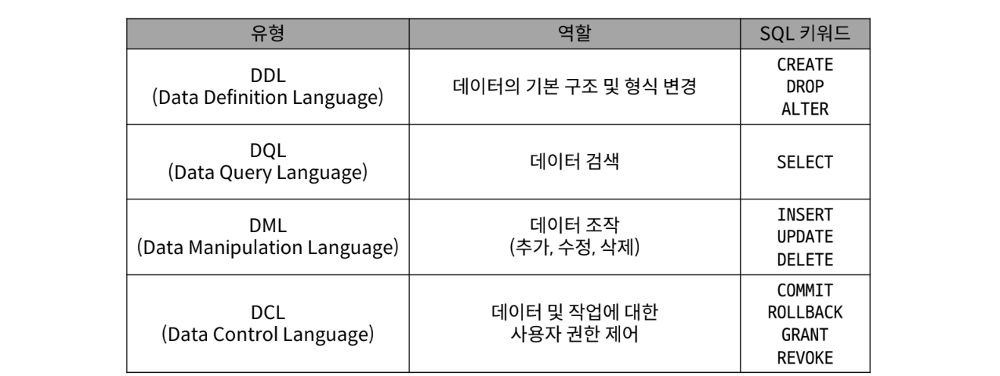
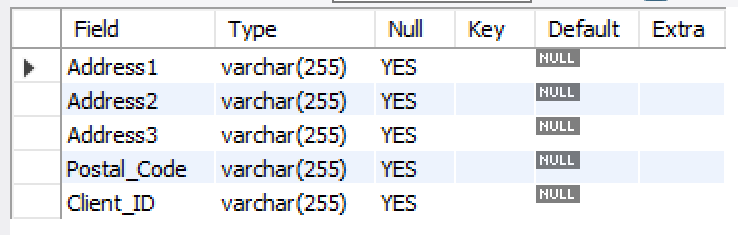
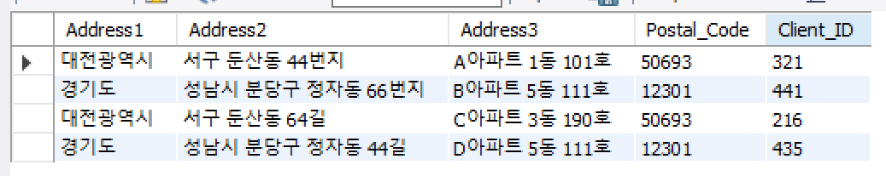
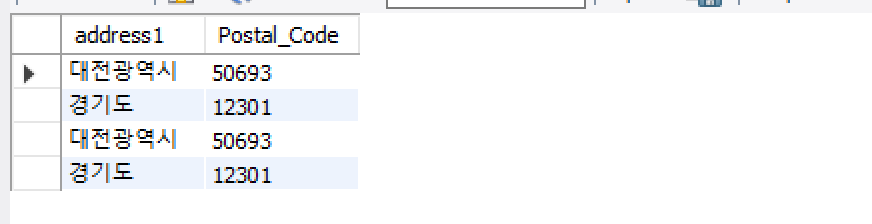
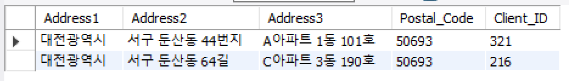
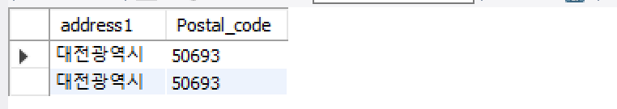

#  workbench 활용 MySQL 접속 방법
1. workbench 실행
2. Database 클릭
3. Connect to Database  (Ctrl +U) 클릭
4. 접속하려는 DB의 정보를 기입
5. Store in Valut ... 클릭
6. 접속 DB의 비밀번호 입력 > OK 버튼 클릭 > OK 버튼 클릭
7. DB 접속 끝

<br>
<br>

# SQL
- 데이터베이스에 정보를 저장하고 처리하기 위한 프로그래밍 언어
- Structre : 테이블의 형태로 `구조화`된 관계형 데이터베이스
- Query : `질의 요청`
- 컴퓨터와의 대화 -> 프로그래밍 언어
  - 관계형 데이터베이스와의 대화 -> `SQL`
- SQL 키워드는 대소문자를 구분하지 않음
  - 하지만 대문자로 작성하는 것을 권장(명시적 구분)
- 각 SQL Statements의 끝엔 세미클론(;)이 필요
  - 세미콜론은 각 SQL Statments을 구분하는 방법

# SQL Statements
- SQL 언어를 구성하는 가장 기본적인 코드 블록
- 데이터베이스에서 수행 목적에 따라 대체로 4가지 범주로 나뉨
  - DDL - 데이터 정의
  - DQL - 데이터 검색
  - DML - 데이터 조작
  - DCL - 데이터 제어
  

> 정리
>  - SQL은 데이터베이스와 상호 작용하고 데이터베이스에서 데이터를 반환하기 위한 언어

## 용어정리
- Query
  - 질의, 질문
  - `데이터베이스로부터 정보를 요청` 하는 것
  - 일반적으로 SQL로 작성하는 코드를 쿼리문(SQL문)이라 함
- SQL 표준
  - SQL은 미국 국립 표준 협회(ANSI)와 국제 표준화 기구(ISO)에 의해 표준이 채택됨
  - 널리 사용되는 모든 RDBMS에서 SQL 표준을 지원
  - 다만 `RDBMS별로 독자적인 기능에 따라 표준을 벗어나는 문법이 존재하니 주의`

<br>
<br>

# Querting data

## SELECT syntax
  - SELECT 키워드 다음에 데이터를 선택하려는 필드를 하나 이상 지정
  - FROM 키워드 다음에 데이터를 선택하려는 테이블의 이름을 지정
## SELECT statement 실행 순서
  - FROM -> SELECT -> ORDER BY
  1. 테이블에서 (FROM)
  2. 조회하여 (SELECT)
  3. 정렬 (ORDER BY)

<br>
<br>

# 쿼리문 작성 및 쿼리문 실행 방법
### - 데이터 베이스 생성
` create database db이름; `# db생성

` use (db이름); `# db사용 명령문

` create table 테이블명(행 열형식);` # 테이블 생성

`desc 테이블명; `# 테이블이름 테이블 구조 내 생각엔...print같은 존재지 않을까...?
```
create database practice_db; # db생성 / test_db : db이름

use practice_db; # db사용 명령문

create table address( # 테이블 생성 / address : 테이블이름
  Address1 varchar(255),
  Address2 varchar(255),
  Address3 varchar(255),
  Postal_Code varchar(255),
  Client_ID varchar(255));

desc address; # address 테이블 구조
```


`insert into 테이블명 values(넣고싶은자료들...);` # 테이블에 데이터 입력

`select * from 테이블명;` # 테이블의 모든 조회
```
# 테이블에 데이터 입력
insert into address values('대전광역시','서구 둔산동 44번지','A아파트 1동 101호','50693','321');
insert into address values('경기도','성남시 분당구 정자동 66번지','B아파트 5동 111호','12301','441');
insert into address values('대전광역시','서구 둔산동 64길','C아파트 3동 190호','50693','216');
insert into address values('경기도','성남시 분당구 정자동 44길','D아파트 5동 111호','12301','435');

select * from address; #address테이블의 모든 조회
```

<br>

### - 특정 필드(컬럼) 조회 
`select 조건1, 조건2 from 테이블명;` # 특정 조건의 열 조회
```
select address1, Postal_Code from address; #address1, Postal_Code 필드 조회

```

<br>

### - 조건있는 특정 행 조회
`select * from 테이블명 where 필드명 = 조건'` 
```
select * from address where address1 = '대전광역시'; # address1이 '대전광역시'인 행 조회
```

<br>

### - 조건의 필드(컬럼)만 조회
```
select address1, Postal_code from address where address1 = '대전광역시';
#address테이블의 레코드 중에서 address1필드(컬럼)의 정보가 '대전광역시'인 것만 address1 컬럼과 Postal_code 컬럼을 가져온다.
```


## 데이터베이스 업데이트
