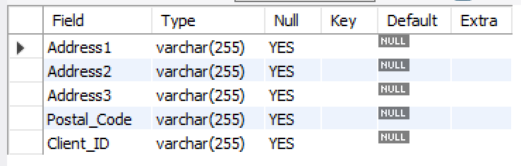

#  workbench 활용 MySQL 접속 방법
1. workbench 실행
2. Database 클릭
3. Connect to Database  (Ctrl +U) 클릭
4. 접속하려는 DB의 정보를 기입
5. Store in Valut ... 클릭
6. 접속 DB의 비밀번호 입력 > OK 버튼 클릭 > OK 버튼 클릭
7. DB 접속 끝

<br>
<br>

# 쿼리문 작성 및 쿼리문 실행 방법
### - 데이터 베이스 생성
` create database db이름; `# db생성

` use (db이름); `# db사용 명령문

` create table 테이블명(행 열형식);` # 테이블 생성

`desc 테이블명; `# 테이블이름 테이블 구조 내 생각엔...print같은 존재지 않을까...?
```
create database practice_db; # db생성 / test_db : db이름

use practice_db; # db사용 명령문

create table address( # 테이블 생성 / address : 테이블이름
  Address1 varchar(255),
  Address2 varchar(255),
  Address3 varchar(255),
  Postal_Code varchar(255),
  Client_ID varchar(255));

desc address; # address 테이블 구조
```
{: width="100" height="100"}


`insert into 테이블명 values(넣고싶은자료들...);` # 테이블에 데이터 입력
`select * from 테이블명;` # 테이블의 모든 조회
```
# 테이블에 데이터 입력
insert into address values('대전광역시','서구 둔산동 44번지','A아파트 1동 101호','50693','321');
insert into address values('경기도','성남시 분당구 정자동 66번지','B아파트 5동 111호','12301','441');
insert into address values('대전광역시','서구 둔산동 64길','C아파트 3동 190호','50693','216');
insert into address values('경기도','성남시 분당구 정자동 44길','D아파트 5동 111호','12301','435');

select * from address; #address테이블의 모든 조회
```
<br>

### - 특정 필드(컬럼) 조회 
`select 조건1, 조건2 from 테이블명;` # 특정 조건의 열 조회
```
select address1, Postal_Code from address; #address1, Postal_Code 필드 조회

```
<br>

### - 조건있는 특정 행 조회
`select * from 테이블명 where 필드명 = 조건'` 
```
select * from address where address1 = '서울특별시'; # address1이 '서울특별시'인 행 조회
```
<br>

### - 조건의 필드(컬럼)만 조회
```
select address1, Postal_code from address where address1 = '서울특별시';
# address테이블의 레코드 중에서 address1필드(컬럼)의 정보가 '서울특별시'인 것만 address1 컬럼과 Postal_code 컬럼을 가져온다.
```